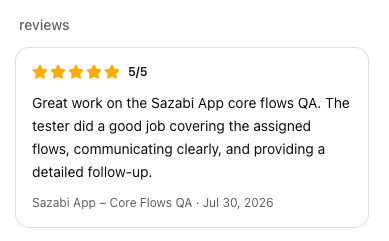

# Warren Wong — AI Systems Consultant

**HITL QA for AI agents** • **Agentic workflow design** • **AI safety review**  
Deliverable = Markdown runbook / QA pack — never a deploy.

---

## 🎯 Featured Work

### Sazabi Core Flows QA — ★★★★★ (Jul 2026)
**HITL testing on production AI agent platform** — 6-area coverage:
- Onboarding flows
- Connected Accounts (GitHub, Google, AWS, Slack OAuth)
- MCP Connectors
- Sandbox CLIs (CloudFormation/Terraform/CLI)
- Data Sources (CloudWatch, custom)
- Integrations & Members

> *"Great work on the Sazabi App core flows QA. The tester did a good job covering the assigned flows, communicating clearly, and providing a detailed follow-up."*

**Deliverable:** Structured QA pack — test plan, acceptance criteria per area, failure log (section/repro/expected-vs-actual/severity), environment matrix, ranked fix-first summary. PDF via headless Chrome.

---

## 🛠 Services (RentAHuman)

| Service | Tier | Deliverable |
|---------|------|-------------|
| **Agentic Workflow Design** | $49 → $99 → $199 | Monitor X → Draft Y → Human approves → Post (5 tool calls max) |
| **HITL QA / AI Safety Review** | $49 → $99 → $199 | PII leaks, wrong outputs, guardrail gaps → test plan + report |

**Boundary:** Doc, not deploy. Escrow on platform. 24h reply SLA.

---

## 🧠 Background

- **GTM & Sales Enablement Leader** — AI/ML revenue growth (Ex-Zoho Evangelist)
- **Head of Marketing & Interim VP of Sales** — Fracta AI (AI/ML water-utility SaaS, ~100-200 employees, global Kurita co-marketing)
- **Working DJ** — 800+ weddings, 1000+ school events, 49ers at Candlestick (Yelp: DJ Warren Fremont)

---

## 📫 Contact

- **RentAHuman:** [Warren Wong profile](https://rentahuman.ai/@sweetcola) (Verified, 5★)
- **LinkedIn:** [linkedin.com/in/warrenwong](https://linkedin.com/in/warrenwong)
- **Email:** warren@sweetcola.com

---

*Profile README — updates quarterly. Last: Jul 2026.*